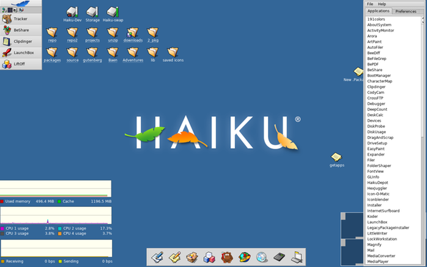

# LiftOff

by Michel Clasquin-Johnson <clasqm@gmail.com>

LiftOff is an application launcher. It always comes up on the opposite side of the Deskbar, and closes down once an app has been launched, with a single click.

LiftOff has a link in the Deskbar (in the Desktop applets section), but launching one launcher from another does not make much sense. It is just to get you started.

Rather use the Shortcuts preference applet to tie LiftOff to a key. If you are right-handed, for example, you can assign this app to F1, then when it comes up, use the mouse to select the application to launch.

LiftOff is Public Domain software. Code was written in the yab language using the Yabadabbadoo IDE

Get it here: https://github.com/clasqm/LiftOff

Binaries: https://sourceforge.net/p/liftoff-4-haiku/
